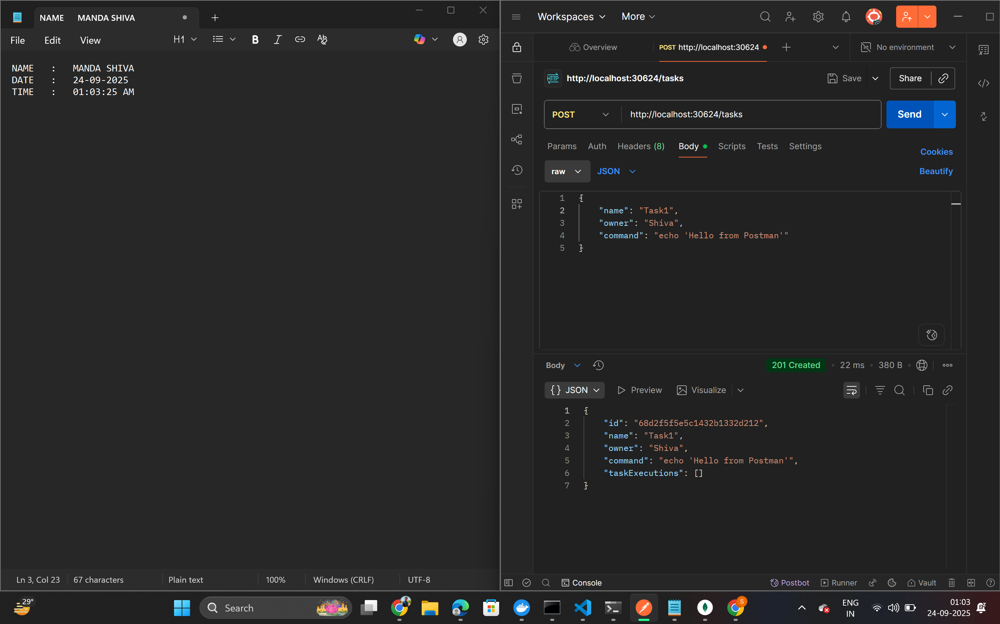
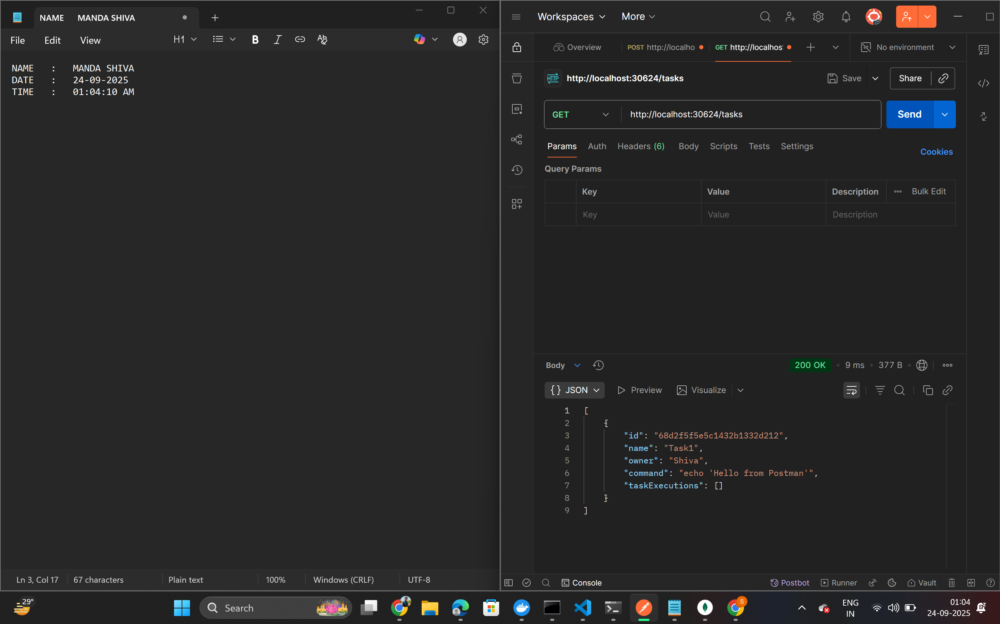
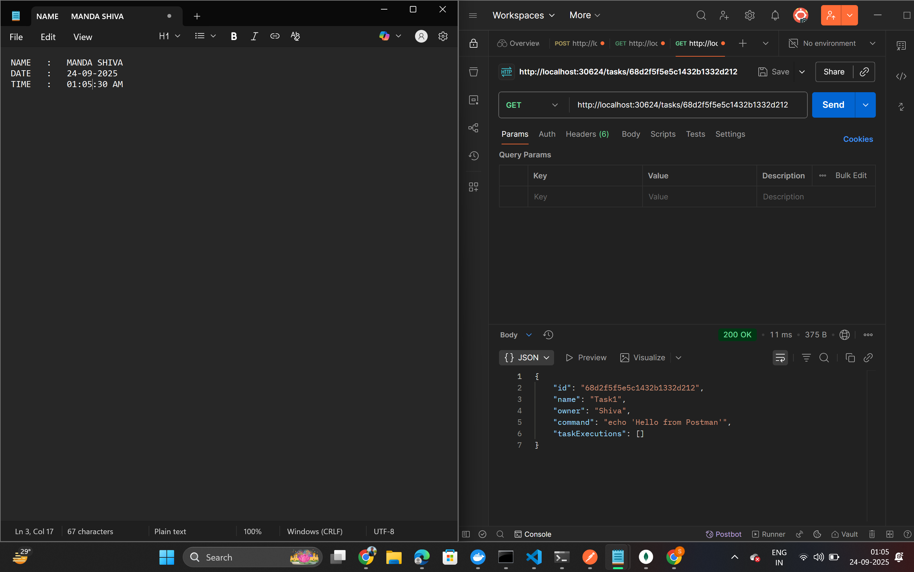
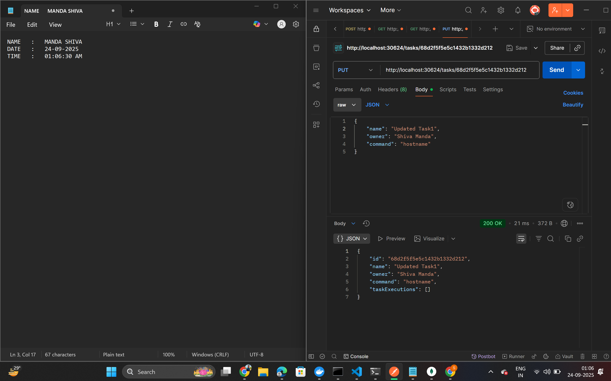
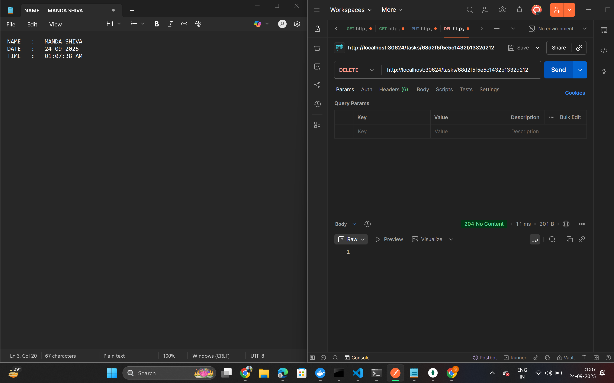
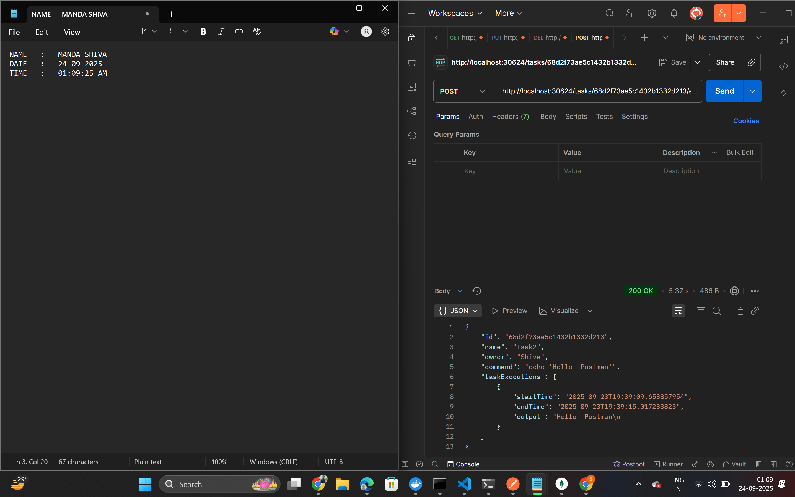
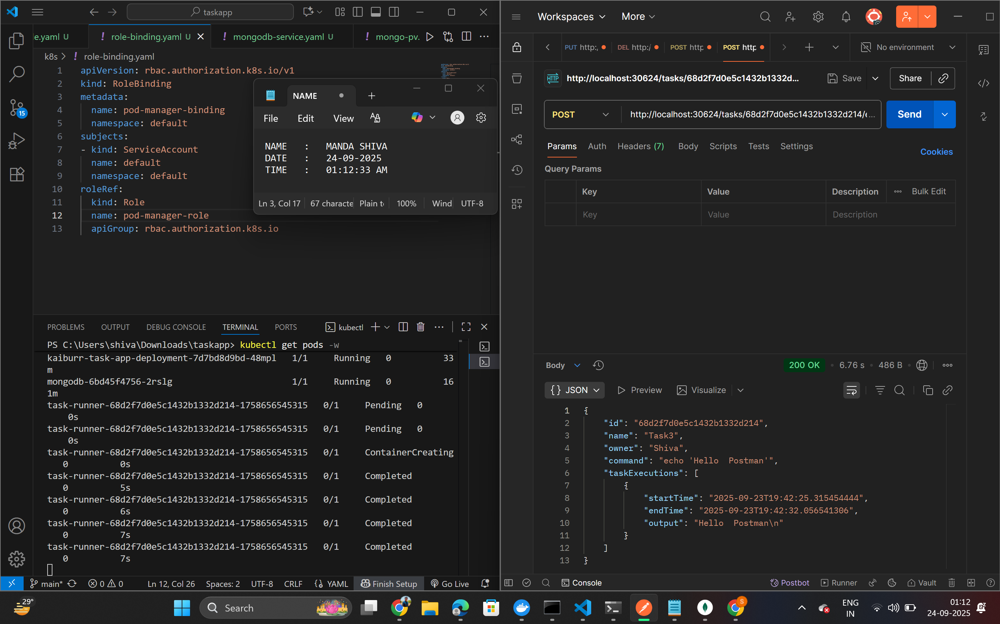

# Kaiburr Assessment - Task 2: Kubernetes Deployment

This repository contains the solution for Task 2 of the Kaiburr Assessment.

The project takes the Java REST API from Task 1, containerizes it with Docker, and deploys it along with a persistent MongoDB database to a local Kubernetes cluster. The application's "execute" endpoint has been modified to programmatically create temporary Kubernetes pods to run shell commands, fulfilling the core requirement of the task.

## Prerequisites

Before you begin, ensure you have the following installed:
* **Docker Desktop**: With the Kubernetes cluster enabled in settings.
* **kubectl**: The Kubernetes command-line tool.
* **Helm**: The package manager for Kubernetes.
* **Java 17+**: For building the application.
* **Maven 3.9+**: For building the application.

## Setup and Deployment

Here are the steps to build and deploy the entire application stack to your local Kubernetes cluster.

## 1. Build and Push the Docker Image
First, build the Java application and then build and push the Docker image to a public registry like Docker Hub.

# Navigate to the Java project's root directory

# Build the JAR file
mvn clean install

# Build the Docker image (replace 'your-dockerhub-username')
docker build -t your-dockerhub-username/kaiburr-task-app:latest .

# Log in to Docker Hub
docker login

# Push the image to Docker Hub
docker push your-dockerhub-username/kaiburr-task-app:latest

## Deploy MongoDB
# Add the Bitnami repository
helm repo add bitnami [https://charts.bitnami.com/bitnami](https://charts.bitnami.com/bitnami)

# Install MongoDB
helm install mongodb bitnami/mongodb --set auth.enabled=false --set persistence.enabled=true

## Deploy the Application

# Apply the permissions for the application to create pods
kubectl apply -f role.yaml
kubectl apply -f role-binding.yaml

# Apply the app-deployment 
kubectl apply -f app-deployment.yam

## Access the Application
kubectl get service kaiburr-task-app-service
Look for the port in the 30000 range (e.g., 8080:3xxxx/TCP). The application API will be available at http://localhost:3xxxx/tasks.

## API Endpoints

| Operation  | Method | Endpoint                    | Description                                       |
|------------|--------|-----------------------------|---------------------------------------------------|
| **Create** | `POST` | `/tasks`                    | Creates a new task.                               |
| **Read All** | `GET`  | `/tasks`                  | Retrieves a list of all tasks.                    |
| **Read by ID** | `GET`  | `/tasks/{id}`           | Retrieves a single task by its ID.                |
| **Update** | `PUT`  | `/tasks/{id}`               | Modifies an existing task by its ID.              |
| **Delete** | `DELETE` | `/tasks/{id}`             | Deletes a task by its ID.                         |
| **Execute** | `POST` | `/tasks/{id}/execute`      | Runs the command for a specific task in a new pod.|

## Demo Video
Watch the demo video here: [Demo Video](https://drive.google.com/file/d/13q9KY-LN0mhZe18JysmYZdZxeqfs_pER/view?usp=sharing)

## ScreenShots

**Create Task**  

**Read All Tasks**  

**Read by ID**  

**Update Task**  

**Delete Task**  

**Execute Task**  

**Temporary Pod**  

==================================================================================================================================================

