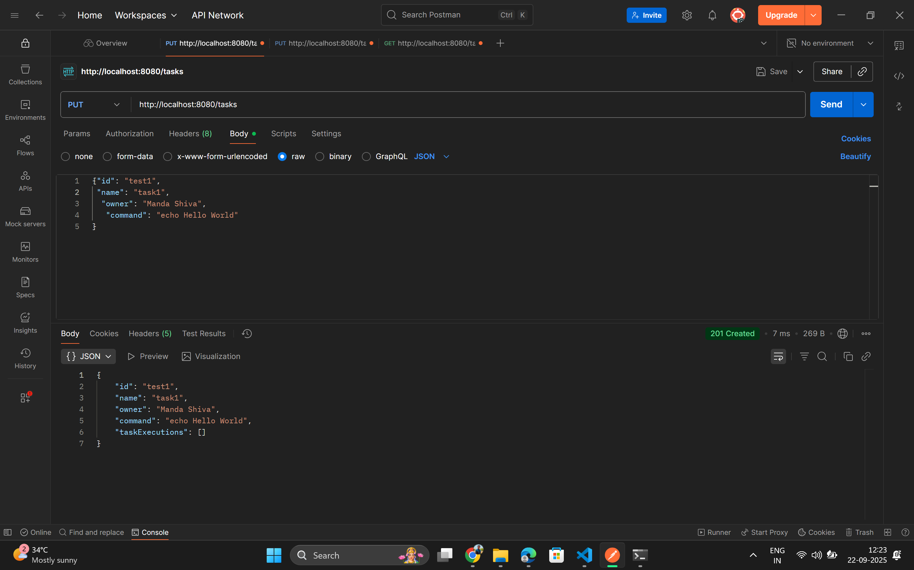
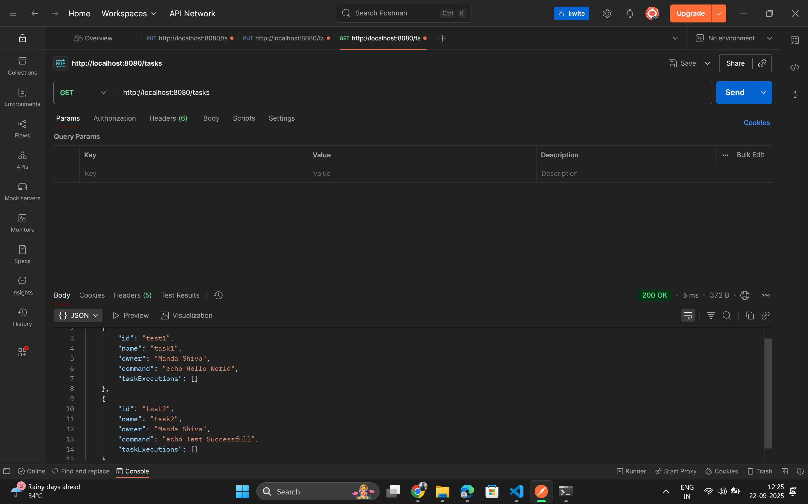
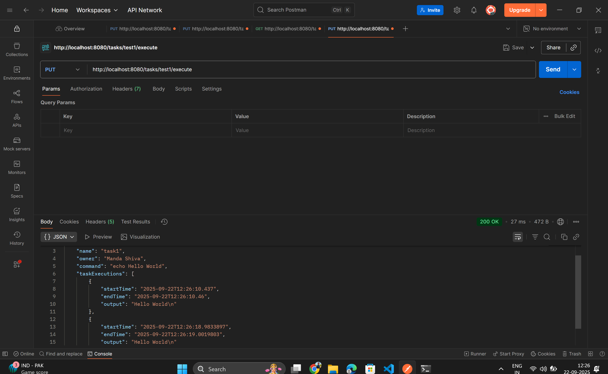
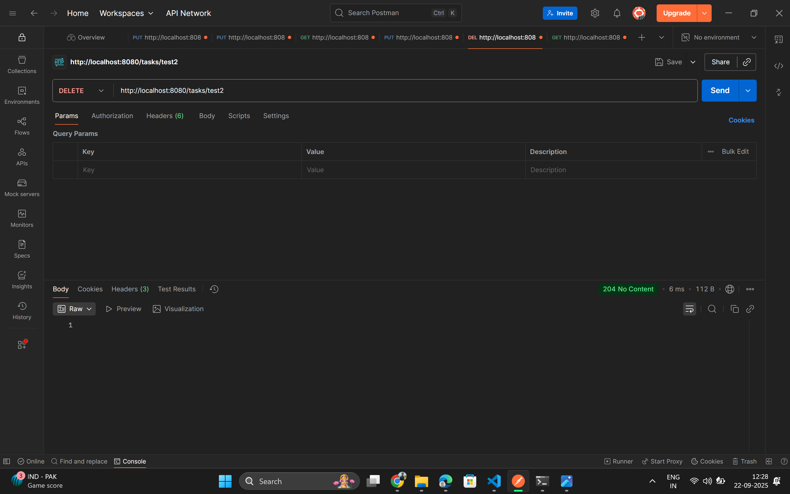
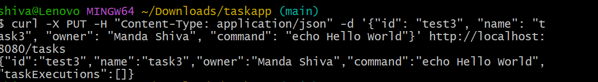
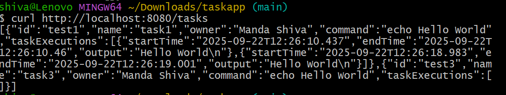
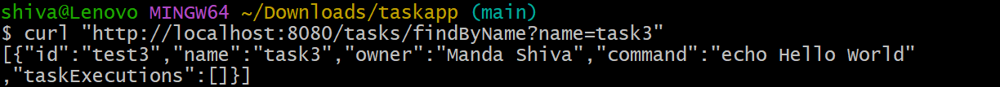
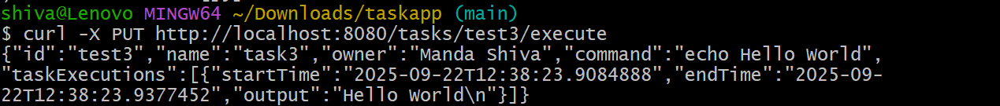
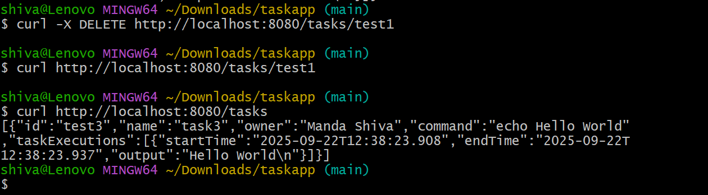

# Kaiburr Task 1: Java REST API

This project is a REST API built with Java and Spring Boot. 
It provides endpoints to create, find, delete, and execute "task" objects, with all data stored in a MongoDB database.

--------------------------------------------------------------------------------------------------

# Prerequisites

- Java 17 (JDK) 
  We prefer Java 17 because it is a Long-Term Support (LTS) release, which makes it the most stable, compatible, and reliable choice for building applications.
  
- Apache Maven
- MongoDB

--------------------------------------------------------------------------------------------------

## How to Compile and Run

1.  **Start MongoDB**: Ensure your MongoDB server is running.
2.  **Build the project**: Open a terminal in the project's root folder and run:
    ```bash
    mvn clean install
    ```
3.  **Run the application**:
    ```bash
    java -jar target/taskapp-0.0.1-SNAPSHOT.jar
    ```
The API will then be available at `http://localhost:8080`.

---

## API Endpoint Documentation

| Endpoint                  | Method | Description                                                              |
| ------------------------- | ------ | ------------------------------------------------------------------------ |
| `/tasks`                  | `PUT`  | Creates a new task. The `id` must be unique.                             |
| `/tasks`                  | `GET`  | Retrieves a list of all tasks.                                           |
| `/tasks/{id}`             | `GET`  | Retrieves a single task by its ID. Returns 404 if not found.             |
| `/tasks/findByName`       | `GET`  | Finds tasks where the name contains the search string (e.g.`?name=Test`).|
| `/tasks/{id}/execute`     | `PUT`  | Executes the command for the specified task.                             |
| `/tasks/{id}`             | `DELETE`| Deletes a task by its ID.                                               |

---

## Screenshots

### POSTMAN


**1. Creating a Task (PUT /tasks)**
(screenshots/create_task2.png)

**2. Getting All Tasks (GET /tasks)**


**3. Getting a Single Task (GET /tasks/{id})**


**4.Getting a task (findByName)**


**5.tasks/{id}/(execute)**


**tasks/{id}(Delete)**



### CURL

**1. Creating a Task (PUT /tasks)**
(screenshots/create_task2.png)

**2. Getting All Tasks (GET /tasks)**


**3.Getting a task (findByName)**


**4.tasks/{id}/(execute)**


**5.tasks/{id}(Delete)**
